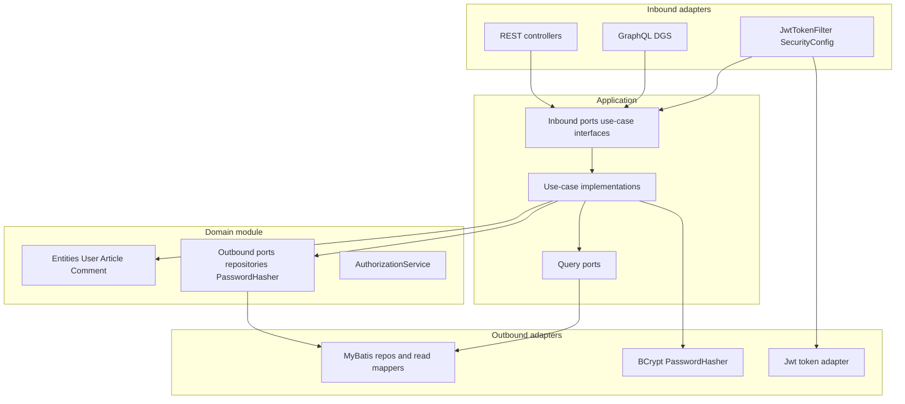

# Hexagonal refactor (behavior-preserving)

Handoff document for sequential agents. Execute **one step per agent**. Do not run steps in parallel. Shared memory is this file, git, and (after step 1) `architecture/violations.md`.

Baseline before any refactor: `./gradlew test` must be green.

## Constraints

The assignment text mentions JPA/Spring Data. **This repo has no JPA.** Persistence is MyBatis + SQLite (`build.gradle`, `MyBatis*Repository`). Treat **MyBatis as the persistence adapter**. Do **not** migrate to JPA.

There is **no custom ThreadLocal/AOP auth**. Current user already comes from Spring Security in the web layer (`JwtTokenFilter`, `@AuthenticationPrincipal`, `SecurityUtil`). The work is: keep it there, stop treating JWT as a domain `@Service`, and stop adapters from orchestrating repositories.

**Anti-pattern to refuse:** renaming `core` → `domain` (or similar) while Spring/MyBatis types still appear on entities, ports, or “domain” classes. A rename is **step 6 only**, after couplings are gone.

**V3 (Lombok on entities) is optional.** It is a purity preference, not required by the assignment (which bans JPA/Spring on entities). Prefer keeping Lombok unless a later step needs a Lombok-free domain Gradle module.

---

## Target shape

Gradle end state (physical guarantee that domain cannot see Spring/MyBatis):

- `:domain` — entities, `AuthorizationService`, write-side repository interfaces, `PasswordHasher`. **Dependencies: none of Spring/MyBatis/Jackson/Security.** Joda-Time may stay (used on `Article`/`Comment`; changing to `java.time` can alter JSON via `JacksonCustomizations`).
- `:application` — inbound use-case **interfaces** + implementations, read DTOs, **query ports** (CQRS). No MyBatis `@Mapper`, no Spring Security.
- `:adapter-persistence` — `MyBatis*Repository` + mapper XML implementing domain write ports **and** application query ports.
- `:adapter-web` — REST, GraphQL, `WebSecurityConfig`, `JwtTokenFilter`, JWT issue/parse.
- `:bootstrap` — `RealWorldApplication`, `application.properties`, Flyway, wiring.

Until step 6, stay in the **existing single Gradle module** so tests keep scanning `io.spring`.

---

## Step 1 — Identify violations (no “fix” yet)

Write `architecture/violations.md` from this inventory. Add ArchUnit (`com.tngtech.archunit:archunit-junit5`) with rules that **document the target** and are `@Disabled` with a pointer to the violation id until that id is fixed. Enabling a rule is the proof that id is gone.

**V1 — Spring on domain ports**

- `JwtService`: `@Service` on an interface (`src/main/java/io/spring/core/service/JwtService.java`)
- `UserRepository`: `@Repository` on an interface (`src/main/java/io/spring/core/user/UserRepository.java`)
- Other repos (`ArticleRepository`, `CommentRepository`, `ArticleFavoriteRepository`) are already annotation-free

**V2 — Domain depends on non-domain helper**

- `User` and `Article` import root `io.spring.Util`

**V3 — Lombok on domain entities (optional)**

- `User`, `Article`, `Tag`, `Comment`, `ArticleFavorite`, `FollowRelation`
- Do not block later steps on this. Assignment does not require removing Lombok.

**V4 — Application → infrastructure (CQRS reads are not ports)**

- `ArticleQueryService` → `ArticleReadService`, `ArticleFavoritesReadService`, `UserRelationshipQueryService`
- `CommentQueryService` → `CommentReadService`, `UserRelationshipQueryService`
- `ProfileQueryService` → `UserReadService`, `UserRelationshipQueryService`
- `UserQueryService` → `UserReadService`
- `TagsQueryService` → `TagReadService`

Those types are MyBatis `@Mapper`s. This is the “left JPA/MyBatis coupling intact” failure if you only rename packages.

**V5 — Adapters orchestrate writes (no inbound ports)**

REST/GraphQL call repositories and build aggregates:

- Favorite: `ArticleFavoriteApi`, `ArticleMutation`
- Comments: `CommentsApi`, `CommentMutation`
- Follow: `ProfileApi`, `RelationMutation`
- Article update/delete: `ArticleApi` uses `ArticleRepository` + `AuthorizationService` in the controller
- Login: `UsersApi` and `UserMutation` use `UserRepository` + `PasswordEncoder` + `JwtService`

**V6 — Auth/token treated as domain**

- `JwtService` lives in `core` with Spring
- `PasswordEncoder` injected into `UserService` (Spring Security in application)
- Domain `User` is the Spring Security **principal** (OK only if Security types stay in adapters)

**V7 — Reverse edge: persistence knows application DTOs**

- MyBatis read XML maps into `io.spring.application.data.*`. Acceptable once query ports live in **application** and persistence **implements** them. Not acceptable if those mappers are imported *from* application.

**Not violations (do not “fix” by inventing ThreadLocal):**

- Application methods taking `User` as a parameter
- REST `@AuthenticationPrincipal User`
- GraphQL `SecurityUtil` reading `SecurityContextHolder`

**Done:** violations file + disabled ArchUnit; `./gradlew test` still green.

---

## Step 2 — (a) Pure domain in place (no package rename)

Keep package `io.spring.core` for now.

- Remove `@Service` / `@Repository` from domain interfaces. Register implementations only with `@Repository`/`@Component` on **adapter** classes (already true for `MyBatis*Repository`).
- Move `Util.isEmpty` into domain (private helpers or `io.spring.core.shared`) so entities do not import `io.spring.Util`.
- Lombok: leave in place unless explicitly doing optional V3. If removing Lombok, **keep a public no-arg constructor** — MyBatis instantiates write-side entities by reflection.
- Do **not** add JPA annotations. Do **not** add MyBatis annotations on entities.
- Leave Joda-Time on `Article`/`Comment`.

Enable ArchUnit: `core` must not depend on `org.springframework..`, `org.mybatis..`, `com.fasterxml.jackson..`.

**Done:** V1–V2 gone (V3 optional); tests green.

---

## Step 3 — (b) Inbound ports + move write orchestration out of adapters

Add use-case **interfaces** in application (e.g. `io.spring.application.port.in`). Implementations wrap existing command services and the logic currently inlined in controllers.

Inbound ports (one method each is enough):

- `RegisterUser`, `LoginUser`, `UpdateUser`
- `CreateArticle`, `UpdateArticle`, `DeleteArticle`
- `FavoriteArticle`, `UnfavoriteArticle`
- `AddComment`, `DeleteComment`
- `FollowUser`, `UnfollowUser`
- Query facades can be the existing `*QueryService` types promoted to interfaces (`GetArticle`, `ListArticles`, `GetFeed`, `GetProfile`, `ListTags`, `GetComments`, `GetCurrentUserData`)

Authorization (`canWriteArticle` / `canWriteComment`) stays domain; **call it from use cases**, not from REST/GraphQL.

Login use case: verify credentials via `UserRepository` + `PasswordHasher` (step 4), return `User`. **Do not issue JWT inside the use case.**

REST/GraphQL then: map HTTP/GQL → call inbound port → map DTO to JSON/GQL payload. No `*Repository` fields on controllers/mutations.

Keep JSON envelopes (`{ "article": ... }`) in the web adapter so API tests stay stable.

**Done:** V5 gone; `@WebMvcTest` / API tests green (mock inbound ports or keep `@Import` of use-case impls as today).

---

## Step 4 — (c) Invert persistence (MyBatis implements ports)

**Write side:** already inverted (`ArticleRepository` in core, `MyBatisArticleRepository` in infrastructure). Keep that; only the interfaces’ package will move in step 6.

**Read side (the real coupling):**

- Define query ports in **application** (they return `ArticleData` / `CommentData` / etc., which are not domain aggregates).
- Change MyBatis `@Mapper` interfaces to implement those ports **or** keep mappers package-private and wrap them in adapter classes that implement the ports.
- `*QueryService` depends only on query ports + domain types — **zero** `io.spring.infrastructure` imports.

Enable ArchUnit: `io.spring.application..` must not depend on `io.spring.infrastructure..` or `org.mybatis..`.

Password hashing: outbound port `PasswordHasher` in **domain**; `BCryptPasswordEncoder` wrapped in adapter-web or adapter-persistence. `UserService` depends on the port, not `PasswordEncoder`.

JWT: move `JwtService` **out of domain** into adapter-web (`TokenIssuer` / `TokenParser`). Bootstrap/filter/login controller use it. Domain no longer mentions tokens.

**Done:** V4, V6 (JWT/password), V7 framed correctly; tests green including `@MybatisTest` (update `@Import` to adapter impls).

---

## Step 5 — (d) Auth only in inbound adapters

- `JwtTokenFilter` stays in web; after parsing token it loads the user via an inbound query or `UserRepository` **only from the adapter** (filter is an adapter).
- Continue putting domain `User` on `SecurityContext` as principal so `@AuthenticationPrincipal` and existing tests keep working (behavior).
- GraphQL keeps `SecurityUtil` (adapter). Do **not** add domain ThreadLocal.
- Strip remaining `SecurityContextHolder` from application if any appears during the move.
- `WebSecurityConfig` remains adapter-web (CSRF off, JWT, public GET `/articles/**`, `/graphql` permitted, etc.) — do not change matcher behavior.

**Done:** no Spring Security types in `core` or application use cases; API auth tests green.

---

## Step 6 — Restructure modules (only after couplings are gone)

Now it is safe to rename/move:

- `io.spring.core` → `:domain` / `io.spring.domain`
- `io.spring.application` → `:application`
- `io.spring.infrastructure` → `:adapter-persistence`
- `io.spring.api`, `io.spring.graphql` → `:adapter-web`
- `RealWorldApplication`, config, `JacksonCustomizations`, `MyBatisConfig` → `:bootstrap`

Add `settings.gradle`. Domain `build.gradle` must not declare Spring, MyBatis, Jackson, or Security. Component scan / DGS `packageName` / mapper locations / Flyway stay in bootstrap+persistence.

Update every test import, `@WebMvcTest`, `@Import(MyBatis*…)`, `TestWithCurrentUser` (it currently `@MockBean`s infrastructure `UserReadService` — mock the **query port** instead).

If multi-module wiring threatens a long red period, split: 6a move packages inside one Gradle project + ArchUnit; 6b extract Gradle subprojects.

**Done:** compile-time domain isolation; full suite green.

---

## Step 7 — Dependency-direction report (expected result)

Enable **all** ArchUnit rules as a first-class test (CI already runs `./gradlew test`):

- domain → no `org.springframework..`, `org.mybatis..`, `com.fasterxml..`, `javax.servlet..`, `org.springframework.security..`
- application → no `org.mybatis..`, no adapter packages
- adapters may depend inward; domain must not depend outward

Add `architecture/dependency-report.md`: how to run ArchUnit, Gradle `:domain:dependencies`, and a short map of ports → adapters. This is the deliverable that proves the rename was not cosmetic.

---

## Behavior freeze (every step)

Do not change: URL paths, JSON/GraphQL shapes, JWT header format, slug algorithm, status codes, SQLite schema, password hashing strength, public vs authenticated routes.

Do not add features. Do not replace MyBatis with JPA.

---

## Agent protocol

1. Read this file and `architecture/violations.md` (once it exists). Execute **one** step.
2. Touch only files needed for that step.
3. Run `./gradlew test`; do not leave the suite red (except enabling an ArchUnit rule that the current step is supposed to make pass).
4. Update the violations file (mark ids fixed).
